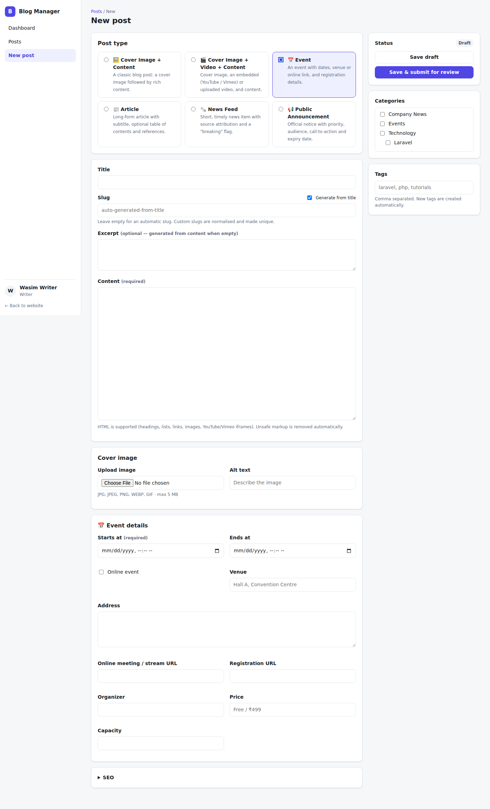
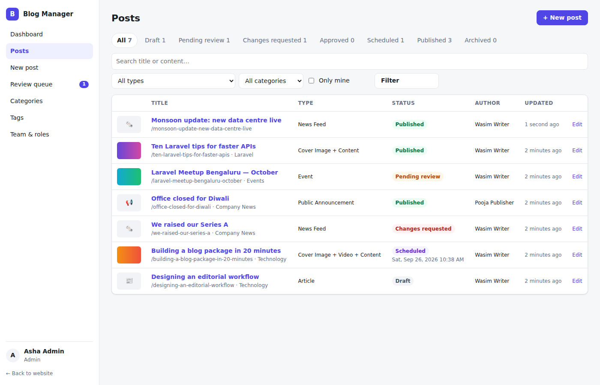
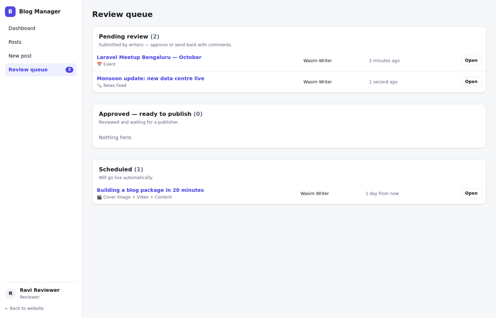
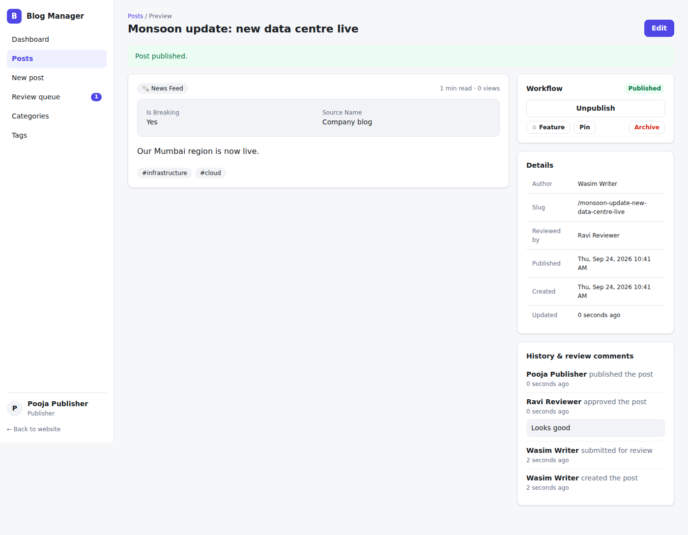
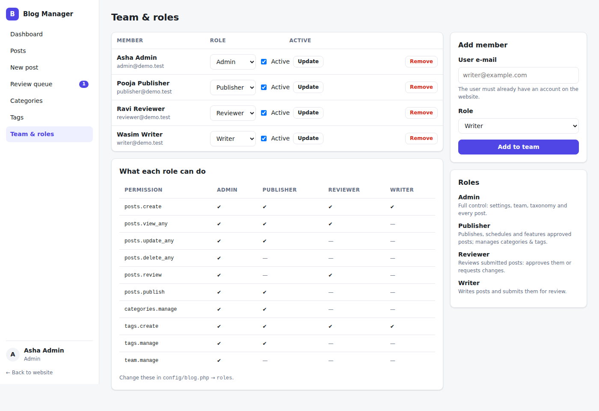

# Laravel Blog (`vitebox/laravel-blog`)

A drop-in blog management backend for any Laravel 12 or 13 application (PHP 8.2+). You get:

- An **admin panel** with role-based access (Admin, Publisher, Reviewer, Writer)
- A full **editorial workflow**: draft → review → approve → publish or schedule
- **Categories** (nested) and **tags**, including a tag merge tool
- **Automatic and custom slugs**. Slugs are always unique, and when a published slug changes, the old URL redirects with a 301
- **Six post types**, and you can add your own:
  1. Cover image + content
  2. Cover image + video + content
  3. Event
  4. Article
  5. News feed
  6. Public announcement
- A **read-only JSON API** that your website front end or mobile app can use

It has no front-end build step and no extra Composer dependencies. It never modifies your `users` table.

---

## 1. Installation

```bash
composer require vitebox/laravel-blog
php artisan blog:install --admin=you@example.com
```

`blog:install` does the following:

- Publishes `config/blog.php`
- Runs the migrations
- Creates the `storage` symlink for uploads
- Makes the given (existing) user a blog **Admin**

Then open **`/blog-admin`**.

> The package is auto-discovered, so you don't need to register a provider or alias.
> The admin panel uses your app's `web` + `auth` middleware, so users log in through your normal login page.

### Using the package from a local folder or a private Git repo

```jsonc
// composer.json of your app
"repositories": [
    { "type": "path", "url": "../laravel-blog" }          // or { "type": "vcs", "url": "git@github.com:you/laravel-blog.git" }
],
"require": { "vitebox/laravel-blog": "@dev" }
```

### Before migrating: UUID / ULID user keys

If your `users` table uses UUID or ULID keys, set this **before** you run the migrations:

```env
BLOG_USER_KEY_TYPE=uuid   # int (default) | uuid | ulid | string
```

### Scheduled publishing

The package adds `blog:publish-scheduled` to Laravel's scheduler. It runs every minute. For it to work, the standard scheduler cron must be running on your server:

```
* * * * * cd /path-to-app && php artisan schedule:run >> /dev/null 2>&1
```

---

## 2. Roles and permissions

| Permission          | Admin | Publisher | Reviewer | Writer |
|---------------------|:-----:|:---------:|:--------:|:------:|
| `posts.create` (write, edit own drafts, submit) | ✔ | ✔ | ✔ | ✔ |
| `posts.view_any`    | ✔ | ✔ | ✔ | – |
| `posts.update_any`  | ✔ | ✔ | – | – |
| `posts.delete_any`  | ✔ | – | – | – |
| `posts.review` (approve / request changes) | ✔ | – | ✔ | – |
| `posts.publish` (publish, schedule, unpublish, archive, feature, pin) | ✔ | ✔ | – | – |
| `categories.manage` | ✔ | ✔ | – | – |
| `tags.create` (new tags while writing) | ✔ | ✔ | ✔ | ✔ |
| `tags.manage`       | ✔ | ✔ | – | – |
| `team.manage`       | ✔ | – | – | – |

The matrix lives in `config/blog.php` under `roles`, so you can change it without touching code. `*` and `posts.*` wildcards are supported.

Other rules:

- Writers see **only their own posts**. They can edit a post only while it is *Draft* or *Changes requested*.
- Reviewers can edit a post while reviewing it. They cannot review their own posts (see `workflow.allow_self_review`).
- The last active Admin cannot be demoted or removed.

**Assigning roles.** Use the admin panel (*Team & roles*), the CLI, or code:

```bash
php artisan blog:role writer@site.com writer
php artisan blog:role writer@site.com --remove
php artisan blog:role --list
```

```php
use Vitebox\LaravelBlog\Facades\Blog;

Blog::assignRole($user, 'publisher');
Blog::roleOf($user);                 // BlogRole enum or null
Blog::can($user, 'posts.publish');   // bool
```

**Emergency access.** Add `BLOG_SUPER_ADMINS="owner@site.com"` to `.env`. Anyone listed there always has Admin access.

**Optional trait for your `User` model:**

```php
use Vitebox\LaravelBlog\Concerns\HasBlogRole;

class User extends Authenticatable { use HasBlogRole; }

$user->blogRole(); $user->hasBlogPermission('posts.review'); $user->blogPosts()->published()->get();
```

**Gates.** The package registers a gate for every permission (`blog.posts.publish`, `blog.categories.manage`, …) and a `PostPolicy`. You can use them in your own code:

```php
@can('blog.posts.publish') … @endcan
Gate::allows('update', $post);
```

---

## 3. Editorial workflow

```
draft ─submit─▶ pending_review ─approve─▶ approved ─publish─▶ published
  ▲                 │                         └─schedule─▶ scheduled ─(cron)─▶ published
  │                 └─request changes─▶ changes_requested ─submit─┘
  └── restore ◀── archived ◀── archive (from any state)
```

- Every transition is recorded in an audit trail, including reviewer comments. The trail is shown on each post.
- **Direct publishing.** Publishers can publish a draft directly unless you set `workflow.direct_publish = false`.
- **Skipping review.** Set `workflow.require_review = false`. Submitted posts then go straight to *Approved*.

**Events.** Listen to these to send notifications (mail, Slack, …):

`PostStatusChanged` (fired on every transition), `PostSubmittedForReview`, `PostApproved`, `PostChangesRequested`, `PostScheduled`, `PostPublished`, `PostUnpublished`, `PostArchived`.

Each event carries `$post`, `$from`, `$to`, `$user` and `$comment`.

```php
Event::listen(PostSubmittedForReview::class, fn ($e) => Notification::send($reviewers, new NeedsReview($e->post)));
```

---

## 4. Post types

| Key            | Cover    | Video    | Extra fields |
|----------------|----------|----------|--------------|
| `standard`     | required | –        | – |
| `video`        | required | required (YouTube / Vimeo / .mp4 URL, or upload) | duration, transcript |
| `event`        | optional | –        | starts_at\*, ends_at, venue, address, is_online, online_url, registration_url, organizer, price, capacity |
| `article`      | optional | –        | subtitle, byline, show_toc, references |
| `news`         | optional | –        | is_breaking, source_name, source_url, location |
| `announcement` | optional | –        | priority\* (low / normal / high / critical), audience, expires_at, show_banner, cta_label, cta_url |

Fields that need to be queried are stored in real, indexed columns: `starts_at`, `ends_at` and `expires_at`. All other fields are stored in the `type_data` JSON column. Everything is validated according to the type.

### Adding your own type

```php
namespace App\Blog;

use Vitebox\LaravelBlog\PostTypes\{PostType, Field};

class PodcastPost extends PostType
{
    public function label(): string { return 'Podcast'; }
    public function icon(): string { return '🎙️'; }
    public function fields(): array
    {
        return [
            Field::url('audio_url', 'Audio URL')->required(),
            Field::text('episode', 'Episode #'),
        ];
    }
}
```

```php
// config/blog.php
'post_types' => [ /* … */ 'podcast' => App\Blog\PodcastPost::class ],
```

The form, validation, storage and API output are generated from these definitions.

---

## 5. Slugs

- **Auto.** If you leave the slug empty, it is generated from the title or name.
- **Custom.** Whatever you type is normalised (transliterated, lower-case, hyphenated).
- **Unique.** On a collision the package appends `-2`, `-3`, … It also checks trashed posts and old redirecting slugs. Reserved words (`admin`, `create`, …) are never used as-is.
- **Redirects.** When the slug of a published post, category or tag changes, the old slug keeps working (the API answers with a 301 to the new slug).
- **Live preview.** The admin form shows the final slug as you type.
- **Title changes.** Editing the title does not change an existing slug, so links don't break. Set `slugs.regenerate_on_title_change = true` if you want slugs to follow title edits (drafts only).

In your own front-end routes:

```php
[$post, $redirected] = Post::findBySlugWithRedirect($slug, fn ($q) => $q->published());
abort_unless($post, 404);
if ($redirected) return redirect()->route('blog.show', $post->slug, 301);
```

---

## 6. Using posts on your website

**Eloquent**

```php
use Vitebox\LaravelBlog\Models\Post;

Post::published()->latestFirst()->paginate(12);
Post::published()->ofType('news')->featured()->take(5)->get();
Post::published()->inCategory('laravel')->get();      // includes sub-categories
Post::published()->withTag('php')->get();
Post::published()->upcomingEvents()->get();
Post::published()->activeAnnouncements()->get();
Post::published()->search('octane')->get();

$post->cover_image_url; $post->summary; $post->reading_time;
$post->video;            // ['provider' => 'youtube', 'embed_url' => …]
$post->field('venue');   // type-specific value
```

**JSON API** (prefix `api/blog`; only published content is exposed)

| Endpoint | Notes |
|----------|-------|
| `GET /posts` | `?type=event,news&category=slug&tag=slug&q=term&featured=1&sort=latest\|popular\|oldest&per_page=12` |
| `GET /posts/{slug}` | Full content plus related posts. Counts a view. Old slugs return a 301. |
| `GET /events/upcoming` | |
| `GET /announcements/active` | |
| `GET /categories` | Nested tree with post counts |
| `GET /categories/{slug}` | |
| `GET /tags` | |
| `GET /tags/{slug}` | |
| `GET /types` | Post type definitions |

---

## 7. Configuration highlights (`config/blog.php`)

| Key | Default | Purpose |
|-----|---------|---------|
| `user_model` | `App\Models\User` | Your user model |
| `table_prefix` | `blog_` | Prefix for all package tables |
| `admin.prefix` / `admin.middleware` / `admin.domain` | `blog-admin` / `['web','auth']` / null | Where the admin panel lives and who can reach it |
| `api.enabled` / `api.prefix` / `api.middleware` | true / `api/blog` / `['api']` | Public API |
| `media.disk` | `public` | Any filesystem disk, e.g. `s3` |
| `content.sanitizer` | `BasicHtmlSanitizer` | Allow-list HTML cleaning. Strips scripts, event handlers and `javascript:` URLs, and only allows YouTube/Vimeo iframes. Bind your own `Contracts\HtmlSanitizer` (e.g. HTMLPurifier) if you prefer. |
| `content.editor` | `textarea` | `trix` loads the Trix WYSIWYG editor |

**Customising the UI.** Run `php artisan vendor:publish --tag=blog-views` and edit the files in `resources/views/vendor/blog`.

---

## 8. Database tables

All tables use the configured prefix:

- `team_members`: user ↔ role
- `posts` (soft deletes)
- `categories` (nested via `parent_id`)
- `tags`
- `category_post`
- `post_tag`
- `post_activities`: audit trail and review comments
- `slug_redirects`

---

## 9. Testing

```bash
composer install
vendor/bin/phpunit
```

The suite contains 42 tests covering roles, the workflow, slugs, post types, the API, the sanitizer and a render check of every admin page.

## License

MIT

## Screenshots

| | |
|---|---|
|  |  |
|  |  |
|  | |
